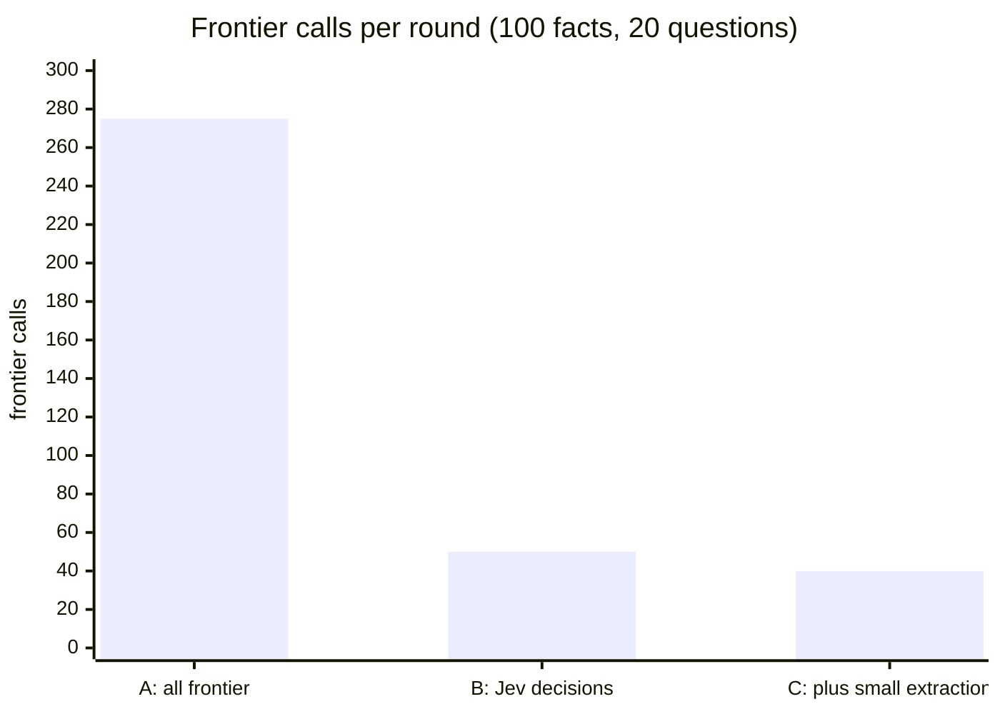

# AIM model call budget

Where aim calls a model, how many calls a sample round costs under three
setups, and what moving work off the frontier model saves. Not a decision
record: for the reasoning see [0000-index.md](0000-index.md),
[ADR-0021](0021-jev-typed-decision-provider.md) and
[ADR-0038](0038-local-decision-models-parked.md). Companion to diagram 4
in [workflow-diagram.md](workflow-diagram.md).

"Frontier" is the frontier chat model (the site default chat model, here
`claude-5-sonnet` on amazeeio). "Decision" is a typed-answer model (hosted
Jev here). "Small" is a small chat model, possibly local, which is
**untested** for aim today.

## Where the models are called

The planned ingest form's second mode, one fact per line, makes no model
call at all (scope and subject are set once on the form); only its prose
mode extracts.

| Place | What it does | Needs | Frontier today | Could move to |
| --- | --- | --- | --- | --- |
| Extraction (`aim:extract`, the ingest form's prose mode) | Text in, list of facts out | Generative, structured output | Yes | Small chat model (untested; see below) |
| Pair classification (`classifyPair()`) | ADD/UPDATE/NOOP/DELETE for one pair | A typed choice | Only if backend is `chat` | Decision model (live: Jev) |
| Merge verifier (`verifyMerge()`) | Does the merged text keep both facts | A yes/no probability | Only if backend is `chat` | Decision model (live: Jev, threshold 0.8) |
| Merge writer (`writeMerge()`) | Writes the merged text for an UPDATE | Generative | Yes | Small chat model (untested) |
| Chat assistant (`aim_chatbot`, `aim_console`) | Answers a visitor, calls the recall tool | Reasoning, tool use | Yes | Stays frontier (or a strong local model) |
| Plausibility gate, grounded check | Not wired (ADR-0033, ADR-0037) | A typed probability | n/a | Decision model |
| Recall, embeddings | Vectors only, no chat | Embeddings | No (local Ollama) | Already local |
| Literal finder (`literals_finder`, optional: behind the literals tool's question mode and the literals chat) | Picks the one literal a question asks for, from a menu of gists | A typed choice | No (hosted Jev here) | Decision model (live: Jev) |
| Convert a fact to a literal | Splits an extracted fact into gist and value | Generative or typed | Not built | Small chat model or decision model |

## Sovereignty by call

How much leaves the building in each call as this site runs today. The
bar is the exposure: how much text, how raw, and to whom. Cells 1 to 3 are
green (stays on infrastructure you control), 4 to 6 amber (short, curated
text to a hosted decision model), 7 to 9 red (raw or complete text to a
hosted frontier model). An empty bar is nothing leaving, the sovereign
goal. Scores are judgments from what each call sends, not measurements.

| Call | Today | What leaves | Local equivalent |
| --- | --- | --- | --- |
| Embeddings (index and query) | ⬜⬜⬜⬜⬜⬜⬜⬜⬜ | Nothing: local Ollama | Already local |
| Guardrails (length, markup) | ⬜⬜⬜⬜⬜⬜⬜⬜⬜ | Nothing: code, no model | n/a |
| Pair classification | 🟩🟩🟩🟨⬜⬜⬜⬜⬜ | Two short facts to Jev | Local decision model (parked, ADR-0038) |
| Merge verifier | 🟩🟩🟩🟨⬜⬜⬜⬜⬜ | Two short facts and a merge to Jev | Local decision model |
| Literal finder | 🟩🟩🟩🟨🟨⬜⬜⬜⬜ | The visitor's question and the gist menu to Jev; no values | Local decision model |
| Merge writer | 🟩🟩🟩🟨🟨🟨⬜⬜⬜ | Two facts to the frontier model | Small local chat model (untested) |
| Convert a fact (planned) | 🟩🟩🟩🟨🟨🟨⬜⬜⬜ | One fact, which may hold the value | Small local chat model |
| Chat assistant | 🟩🟩🟩🟨🟨🟨🟥⬜⬜ | Visitor questions plus recalled facts to the frontier model | Strong local chat model |
| Grounded check (planned, ADR-0037) | 🟩🟩🟩🟨🟨🟨🟥⬜⬜ | A fact and its source passage | Local decision model |
| Extraction | 🟩🟩🟩🟨🟨🟨🟥🟥🟥 | Whole source documents to the frontier model | Small local chat model (untested) |

Reading it: extraction is the single largest exposure, and the one place
where chunking and a local model both still have to be built. The finder
is cheap on exposure because literal values never reach it, and in answer
mode 1 (literal only) never reach a chat model either.

## Measured per call (`aim_activity_metrics`, 2026-10-02)

| Call | Model | Calls seen | Input tokens | Output tokens | Time |
| --- | --- | --- | --- | --- | --- |
| Classify | Jev | 748 | 471 | 46 | 0.31 s |
| Classify | Frontier | 298 | 1043 | 92 | 1.78 s |
| Verify | Jev | 2 | 431 | 22 | 0.27 s |
| Verify | Frontier | 10 | 934 | 34 | 1.32 s |
| Merge writer | Frontier | 2 | 717 | 106 | 1.77 s |

## Sample round: 100 new facts from 5 text files, 20 chat questions

Assumes about 2.25 pair decisions per new fact (a dry run gave 1.5, the
design allows up to 3), so 225 decisions, 5 of them UPDATEs, and 2 chat
turns per question (the recall tool call, then the answer). Chat turns
are not metered per call here, so token figures cover decisions and
merges only.

| | A: all frontier | B: Jev decisions (this site) | C: B plus small-model extraction and merge |
| --- | --- | --- | --- |
| Frontier calls | 275 | 50 | 40 |
| Jev calls | 0 | 230 | 230 |
| Small-model calls | 0 | 0 | 10 |
| Frontier input tokens (decisions and merges) | about 239,000 | about 3,600 | 0 |
| Time for the decisions, sequential | about 407 s | about 80 s | about 80 s |
| Same, 8 requests at once | n/a | about 10 s | about 10 s |

What the numbers say:

- **B removes about 82% of frontier calls and about 98% of frontier
  input tokens** for decisions, and is about 5x faster sequentially.
  Nothing else changes: the same chat model still extracts, writes
  merges and answers the visitor.
- **C removes only 10 more calls, but it is the biggest sovereignty step.**
  By call count it looks minor, because extraction is one call per file
  and merge writing one per UPDATE. By data exposure it is the largest
  move in the table. Extraction sends the whole source document (raw
  notes, emails, transcripts: the most complete and least curated text the
  business has) to the model, while a Jev decision call sees two short
  facts (about 100 tokens). A small model run locally keeps all the raw
  documents and the merge writing inside the building, and what still
  leaves is only short atomic facts to the decision model and visitor
  questions with their recalled facts to the chat assistant. If the
  small model is hosted, C gains nothing on sovereignty, only cost: the
  move only counts when the model is local. It also cuts frontier input
  tokens by the size of every ingested file (not metered here, so not in
  the table). What C does not fix: decisions still go to hosted Jev, and
  the chat assistant is still frontier, so full sovereignty needs those
  local too. Untested: whether a small local model extracts well enough
  (see below), which is why C is a direction and not a recommendation yet.
- **The remaining 40 are the chat assistant.** They are the visitor-
  facing reasoning and are the last thing to move off the frontier.

## Can a small model extract?

Plausibly: extraction is text to short sentences, not reasoning. But
nothing in aim measures it. Two risks: a weaker model hallucinates facts
the text does not contain, and misses real ones. Hallucination is what
the grounded check in [ADR-0037](0037-transient-source-passages-for-grounding.md)
is for, and it is a decision call (cheap, typed), so a small extractor
plus a grounded check is the natural pairing. To decide, build an
extraction eval (text in, labeled fact list out; score recall and
unsupported facts) the same way `decision-eval.py` scores decisions.
Large files also need chunking, which does not exist yet (TODO).

## Sovereignty (a business-critical issue) and accuracy

**Sovereignty is the main cost of setup B, not a footnote.** For a business
it can be the deciding factor: setup B sends every pair of fact texts to
hosted Jev and, for extraction, merging and chat, to the frontier
provider. Whatever the business has told its memory leaves the building.
That is a temporary deviation from CLAUDE.md decision 5, recorded in
[ADR-0021](0021-jev-typed-decision-provider.md)'s 2026-10-02 addendum, and
it is acceptable for synthetic and demo data only: hosted Jev has no
documented default retention (not trained on requests; zero data
retention is an enterprise agreement, secondhand). The savings above are
real, but they are bought with data leaving the building. Treat a
sovereign path (a local decision model and a local chat model for
extraction and merging) as a requirement for any real deployment, not an
optional extra. A local decision model costs 10-14 s per call on the dev
laptop plus heavy memory use ([ADR-0038](0038-local-decision-models-parked.md));
the chat backend stays selectable per activity as the fallback.

**Accuracy.** Setup B may be more accurate than setup A, not just
cheaper, but this is not measured. The evidence so far: on the same 94
neighbor pairs the frontier chat backend returned 3 UPDATEs and Jev
returned all ADD, and on reading all three, Jev's ADD was the safer call
(the chat model would have merged the Hyperslop codename into the target
audience, for example). Jev scored 23/24 on the hand-written pairs and
25/25 on real pairs, and its merge verifier separated faulty merges at
AUC 1.00. The frontier chat backend has never been scored on those same
sets, so "more accurate" is a hypothesis. A fair test is a replay of
`decision-eval-sets.json` through `ChatBackend` (the TODO's PHP replay
command), then a comparison on the same labels. A frontier model is the
better writer of a merge; a typed decision model is plausibly the better
judge of whether to merge.

## Conclusion

**The end state is a fully sovereign system, and it is achievable.**
aim's model work is three kinds, and each has a local equivalent:
embeddings (already local, Ollama), inference (extraction, merge writing
and the chat assistant, on a local chat model) and decisions (pair
classification, merge verification, later the grounded check, on a local
decision model of the same kind as Jev). With all three running locally,
nothing leaves the building, and the system is sovereign.

Jev is the hosted version of that third piece, and the reason to use it
now is that it works today: it is fast (0.4 s per call), accurate on
every eval set (23/24 pairs, 25/25 real pairs, merge AUC 1.00) and cheap.
Using it is a choice of where the decision model runs, not a dependency:
swapping it for a local equivalent is a settings change on `activities.*`
with no code, because the decision backend is provider-agnostic and the
eval harness scores any `/v1/systemone` host. Until then, the only thing
that leaves is short atomic fact text going to the decision model, the
smallest and most curated traffic in the system.

What closes the gap is hardware and model maturity, not design. The dev
laptop is not a yardstick for local model hosting (see ADR-0038). On it (no GPU, 14 GB) the local decision model was slower and weaker
(`tev1:4b` 17/24 pairs at 10-14 s per call against Jev's 23/24 at 0.4 s,
[ADR-0038](0038-local-decision-models-parked.md)); on production hardware
with a GPU, or with a better local decision model, the same architecture
runs the whole stack in-house. Build and measure toward that end state,
with Jev as the working reference the local model has to match.
