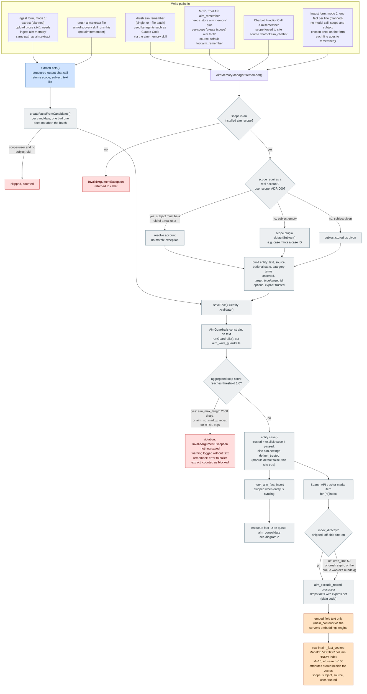
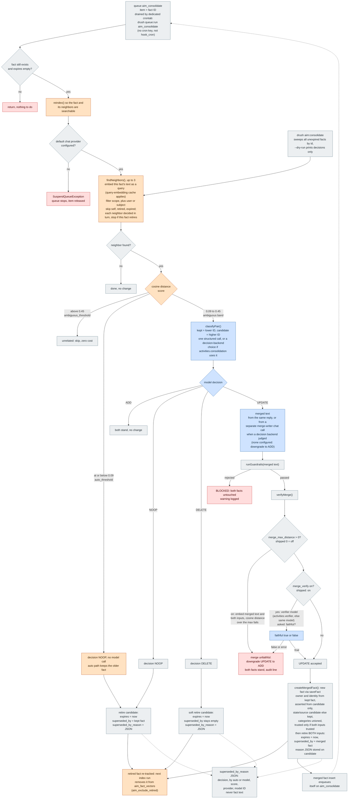
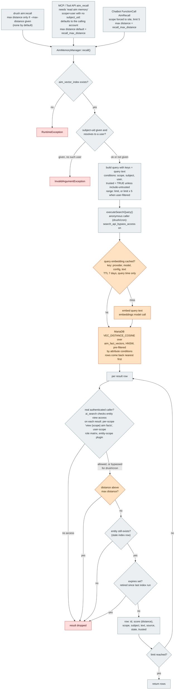
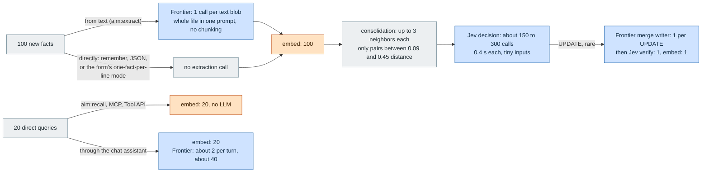
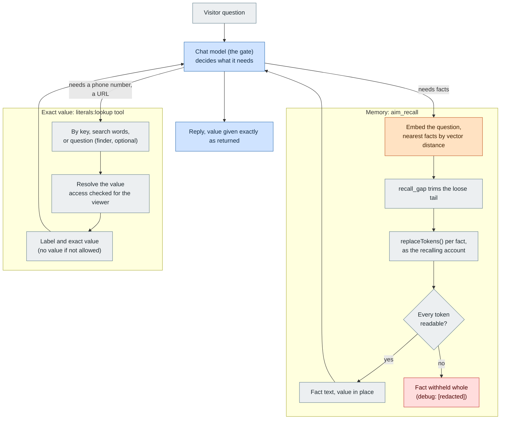

# AIM memory workflow diagrams

How a fact moves through the module, as the code stands on 2026-10-02
(`AimMemoryManager`, `AimConsolidateQueueWorker`, `AimCommands`,
`AimGuardrailsConstraint`, `aim_tool`, `aim_chatbot`). Not a decision
record: for the reasoning see [0000-index.md](0000-index.md).

Five diagrams: write path (1), consolidation (2), recall (3), and
call counts for a sample round (4), and exact values (5). The
write path ends by enqueuing a fact for consolidation, which is the
hand-off into diagram 2. Diagram 3 reads what diagrams 1 and 2 left in
the vector table.

Color key, used in all three:

- Blue, "LLM": a chat or decision model is called (can be remote).
- Orange, "Vector": embedding or vector math (an embeddings model call
  at index/query time, or MariaDB cosine distance in SQL).
- Gray, "Code": plain PHP, config or database logic, no model.
- Red: a rejection or dead end.

## 1. Write path: input to saved, queued and indexed fact

Notes on diagram 1:

- The ingest form (planned, ADR-0016 Mode 1) has two plain-text modes:
  prose goes through extraction (one frontier call per file, the model
  picks scope and subject); one fact per line skips the model entirely
  (scope and subject set once on the form, deterministic, free). A JSON
  file in the `aim:remember --file` shape stays as an advanced option for
  case IDs and entity targets, which extraction cannot set.
- Indexed fields: `text` is the embedded content. `scope`, `subject`,
  `source`, `user` and `trusted` are stored as attributes. The filterable
  ones used by code are `scope`, `subject`, `user` (BTREE index) and
  `trusted` (BTREE index). `source` is stored but no code filters on it.
  `expires` is not indexed: retired facts are removed by the processor
  instead.
- Guardrails here are deterministic (regexp plus length). The set has no
  LLM-backed guardrail, so the gate makes no model call.
- A rewriting guardrail would replace the text before save; none ships.

## 2. Consolidation: queue to retired or merged facts

Notes on diagram 2:

- Thresholds are cosine distances, lower is closer: "at or below"
  means more similar. Defaults 0.09 and 0.45 live in
  `AimMemoryManager::DEFAULT_*`; the live values come from
  `aim.settings` (`auto_threshold`, `ambiguous_threshold`).
- Retirement is always soft. Nothing is deleted from `aim_fact`, and a
  retired fact can be un-retired by the admin action.
- `ADD` and `BLOCKED` change nothing, and the same pair is simply
  evaluated again on a later sweep.
- The queue and the sweep both call the same `decideAndApply()`.

## 3. Recall: query to returned facts

Notes on diagram 3:

- Recall makes no chat-model call. The only model involved is the
  embeddings model, and only on a cache miss.
- Score is a distance: 0 is identical. The default cutoff is 0.45 in
  code, 0.48 on this site (ADR-0019 addendum).
- `recall()` itself has no explicit access call: per-result access is
  enforced inside Search API's ai_search backend, and is bypassed for an
  anonymous (drush/cron) caller by design.
- Untrusted facts are excluded by the `trusted = TRUE` condition unless
  `--include-untrusted` is passed (no Tool API or chatbot path passes it).

## Legend (plain English)

- **Write path.** Everything funnels into one of two PHP methods.
  `remember()` stores exactly what a caller hands it (CLI, MCP tool,
  chatbot tool); no model decides what is worth keeping. `aim:extract`
  is the only path where a model reads source text and proposes facts,
  and those candidates then go through the same validation and save
  step. The aim-discovery skill ("the grill") is not a separate path: it
  interviews, writes a notes file, and runs `aim:extract` on it.
- **Guardrails.** A fact is validated as an entity field constraint on
  `text` before it is saved. The shipped rules are a 2000 character cap
  and a no-HTML-tags pattern. A failure saves nothing; a single-fact
  caller gets an error, an extraction batch just counts it as blocked and
  carries on.
- **Trusted.** A new fact takes `aim.settings:default_trusted` unless
  the caller passes an explicit value (only curated seed data does).
  Recall hides untrusted facts by default.
- **Indexing.** Saving a fact marks it for indexing. Its text is turned
  into an embedding and stored with a few filterable attributes in
  `aim_fact_vectors`. Retired facts are removed from that table.
- **Consolidation.** Runs later, off the request path, one queue item per
  new fact. Same-scope nearest neighbor by cosine distance: very close
  is retired without a model, moderately close asks a model to choose
  ADD (keep both), NOOP (restatement), DELETE (should not exist) or
  UPDATE (merge into a new fact). A merge must pass the guardrails and a
  faithfulness check or it falls back to keeping both.
- **Retire.** Setting `expires` (and where there is a replacement,
  `superseded_by`) hides a fact from recall and the index without
  deleting it. `superseded_by_reason` records how and by what it was
  decided, with no fact text.
- **Recall.** Embed the query (cached), find nearest vectors with
  attribute filters, then drop anything the caller may not see, is too
  far away, is retired or has gone missing.

## 4. Calls per round: 100 new facts and 20 direct queries

Estimates from the code and one dry run (63 facts gave 94 consolidation
decisions, about 1.5 per fact), not a measurement. "Frontier" is the
frontier chat model (the site default chat model); "Jev" is whichever
decision backend `activities.consolidation` and `activities.verifier`
use; "embed" is the local embeddings model.

Notes on diagram 4:

- **Extraction is one call per input, not per fact.** `aim:extract` reads
  the whole file into one prompt (no chunking), so a file larger than the
  frontier model's context fails; split big files first.
- **Jev limits** (secondhand, from TypeSafe's public docs summary, not
  verified against the live API): 64k context, 32k tokens for the state
  plus the longest question; 40 requests/s and 100k tokens/s. A pair of
  facts is about 100 tokens (a fact is capped at 2000 characters by the
  write guardrail, about 500 tokens), far inside every limit.
- Cost: Jev is $0.042 per million input tokens, so 300 calls are well
  under a cent; the amazeeio frontier model is free.

## 5. Exact values: how a literal reaches an answer

Memory recall and exact values are separate. Recall finds facts; the
assistant calls a lookup tool when it needs an exact value. The value
always comes from the `literals` store, read as the person asking.

Read it this way:

- **The model is the gate.** It decides whether a question is a one-shot
  value lookup, so nothing calls a decision model on every recall.
- **Nothing is copied.** The value lives in the literal; a fact holds at most
  a token, so editing the literal changes every answer with no reindex.
- **Who sees what is decided at read time**, by the person asking.
- **The finder is optional.** It only maps a loose question to a literal for
  the tool's `question` mode; key and search-word lookups need no model.
